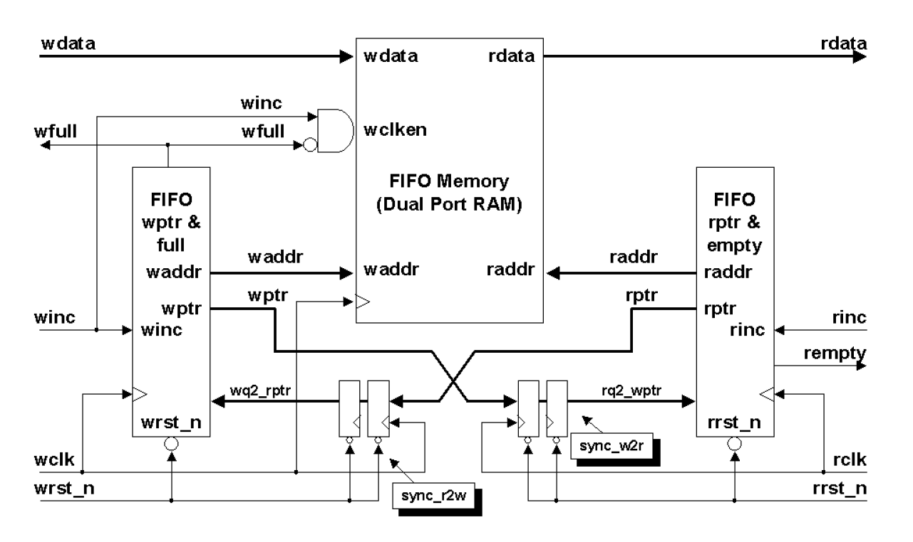

# Asynchronous FIFO memory

An asynchronous FIFO refers to a design where data values are written to a FIFO memory from one clock domain and the data values are read from the same FIFO from another clock domain, where the two clocks are asynchronous to each other. This is useful when the input has a greater frequency than the output. Write data must be safely stored in the FIFO until it is retreived using the slower read operation. For e.g. Ethernet write and PCIe read.

Unlike synchronous FIFO, in asynchronous FIFO the increment-decrement fill counter cannot be used, because two different clocks would be required to control the counter. To determine full and empty status here, the write and read pointers will have to be compared. Due to asynchronous clocks, each pointer must be synced with the other block before comparison. We use Gray code for the pointers, since only one bit changes at a time so there is no problem synchronizing multi-bit transitions between clock domains.

The block diagram of the architecture is given below.



To run the code using Icarus Verilog compiler, run the following command in the terminal:

```
iverilog -o test_bench.vvp test_bench.v
vvp test_bench.vvp
```

This will create a waveform.vcd file, giving us the timing diagram.

